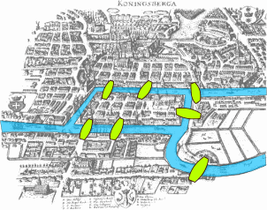
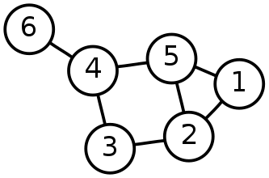
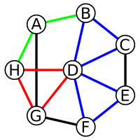
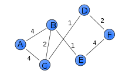
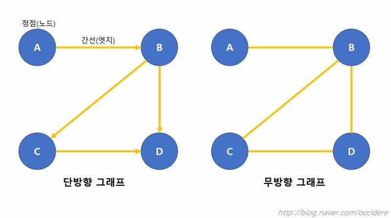
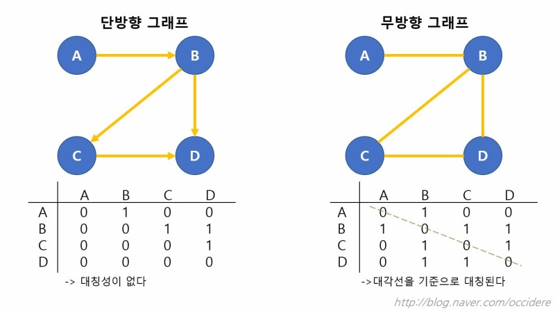
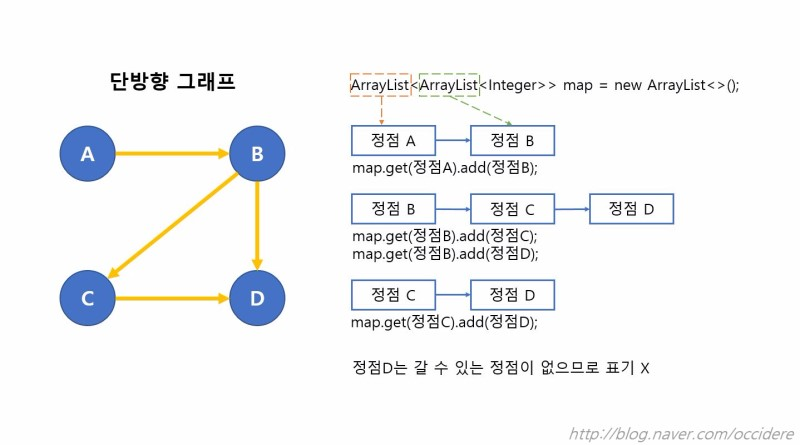
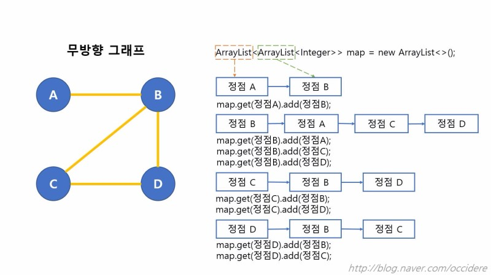

# 그래프

## 쾨니히스베르크 다리 문제

프로이센의 쾨니히스베르크(오늘날 러시아 칼리닌그라드)에 강이 있고 강으로 둘러싸인 섬이 하나 있다. 섬을 잇는 다리가 7개가 있는데 이를 모두 한 번씩만 건너서 출발한 곳으로 다시 돌아오려고 하는 사람들이 있었지만, 아무도 답을 찾지 못했다. 수학자 오일러가 이는 불가능하다는 것을 밝혀냈는데, 여기서 나온 방법론이 방법이 한 번쯤은 들어봤을 법한, 한붓그리기라는 개념이다.

> 참고 - [한붓그리기](https://ko.wikipedia.org/wiki/%ED%95%9C%EB%B6%93%EA%B7%B8%EB%A6%AC%EA%B8%B0)

이처럼 이동할 수 있는 방법을 탐색하는 방법론을 그래프 이론 혹은 그래프 알고리즘이라 한다. 더 정확히는 객체 간의 짝을 이루는 관계를 모델링하기 위한 수학 구조를 그래프라 한다.

 

## 그래프의 구성

그래프는 **꼭짓점(vertex;정점 혹은 교점;node 혹은 점;point)** 으로 구성되며, 이들은 **변(edge; 간선 혹은 link)** 으로 연결된다. 이때 두 꼭짓점 사이에 변이 존재하는 것을 **인접(adjacent)** 이라고 한다. 또한, 어떠한 변을 구성하는 꼭짓점들은 해당 변과 '**근접(incident)하다'** 라고 한다.

 

## 보행(walk)

보행은 꼭짓점과 변이 교대로 나타나는 열(sequence)이면서, 각 변의 앞과 뒤에 위치한 꼭짓점을 그 변의 양 끝점으로 갖는 열을 뜻한다.

> 간단히 말하면, 보행은 그래프상에서 어딘가를 지나가는 것이다.

보행의 종류는 다음과 같다.

- 트레일(trail) : 변이 중복되지 않는 보행
- 경로(path) : 꼭짓점이 중복되지 않는 트레일. 변과 꼭짓점이 모두 중복되지 않는 보행과 같다.
- 닫힌 보행(closed walk) : 시작점과 끝이 같은 보행이다.
- 닫힌 트레일(closed trail) : 변이 겹칠 수 없는 닫힌 보행이다.
- 순환(cycle) : 꼭짓점이 겹치지 않는 닫힌 트레일을 뜻한다. 다른 말로는 회로(circuit) 또는 여행(tour)라고 한다.

위 그래프에서,

HAB와 HDG는 경로이다.

BDEFDC는 트레일이다. 꼭짓점 D가 반복되므로 경로는 아니다.

HABAH는 닫힌 보행이다.

BDEFDB는 보행이다. 변 BD가 반복되기 때문이다.

BDEFDCB는 닫힌 트레일이다. 꼭짓점 D가 반복되므로 순환이 아니다.

HDGH는 순환이다.

 

## 그래프 크기의 척도

- 거리(distance) : 두 꼭짓점 사이의 경로 가운데 가장 짧은 것의 변의 수이다. 만약 이러한 경로가 존재하지 않는다면, 거리의 길이는 무한대이다.
- 이심률(eccentricity) : 한 꼭짓점에서 다른 모든 꼭짓점 사이의 거리 중 가장 큰 거리
- 지름(diameter) : 그래프의 최대 이심률
- 가중치(weight) : 정점 또는 변에 할당된 비용 또는 거리

> - 무게는 정점 또는 변에 할당된 비용 또는 거리이다.

- 그래프 문제 중 최단 경로 문제는 가중치의 합이 최소가 되는 경로를 구하는 문제이다.
- 가중치 그래프(weighted graph)는 네트워크(network)라고도 한다.

 

## 그래프의 종류

그래프는 크게 유향 그래프와 무향 그래프로 나눌 수 있다. 유향 그래프는 말 그대로 그래프에 방향성이 있는 것이다.

> 모든 보행이 양방향인 유향 그래프는 무향 그래프이다.

### 무향 그래프의 요소

- 차수(degree) : 한 꼭짓점에 이어져 있는 변의 수

 

### 유향 그래프의 요소

- 입력 차수(in-degree) : 한 꼭짓접으로 들어오는 변의 개수
- 출력 차수(out-degree) : 한 꼭짓점에서 나가는 변의 개수

 

## 그래프의 표현

그래프는 크게 인접, 근접, 차수를 이용하여 표현할 수 있다. 그중 인접을 이용한 인접 행렬과 인접 리스트로 표현하는 경우가 많다.

> 그래프를 행렬로 나타낼 경우 직관적이다. 하지만, 2차원 배열로 그래프를 표현하기 때문에 불필요한 정보의 저장이 많아진다. 따라서 알고리즘에는 리스트가 주로 사용된다.

 

### 인접 행렬(Adjacency Matrix)

인접 행렬 그래프는 보행을 1, 보행할 수 없는 꼭짓점의 관계를 0으로 표현한다.

### 인접 리스트 그래프(Adjacency List)

인접 리스트 그래프는 리스트(List)나 벡터(Vector) 등의 자료구조를 이용하여 보행이 가능한 꼭짓점들을 저장한다.

---

#### References

- [쾨니히스베르크 다리 문제 - 수학 이야기](https://suhak.tistory.com/54)
- [그래프 이론 기초 정리 - kwangsik lee's blog](http://www.kwangsiklee.com/2017/11/%EA%B7%B8%EB%9E%98%ED%94%84-%EC%9D%B4%EB%A1%A0-%EA%B8%B0%EC%B4%88-%EC%A0%95%EB%A6%AC/)
- [쉽게 쓴 그래프 알고리즘 기초 - 코딩과 디버깅 사이](https://m.blog.naver.com/occidere/220923695595)
- [그래프 이론 - 위키백과](https://ko.wikipedia.org/wiki/%EA%B7%B8%EB%9E%98%ED%94%84_%EC%9D%B4%EB%A1%A0)
- [가중 그래프 - 위키백과](https://ko.wikipedia.org/wiki/%EA%B0%80%EC%A4%91_%EA%B7%B8%EB%9E%98%ED%94%84)
- [경로(그래프 이론) - 위키백과](<https://ko.wikipedia.org/wiki/%EA%B2%BD%EB%A1%9C_(%EA%B7%B8%EB%9E%98%ED%94%84_%EC%9D%B4%EB%A1%A0)>)
- [IT CookBook, 쉽게 배우는 알고리즘](http://www.hanbit.co.kr/store/books/look.php?p_code=B7707942187)
