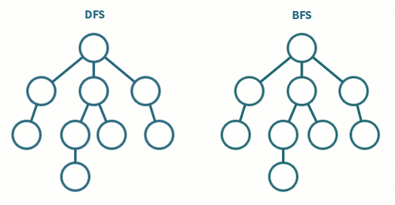
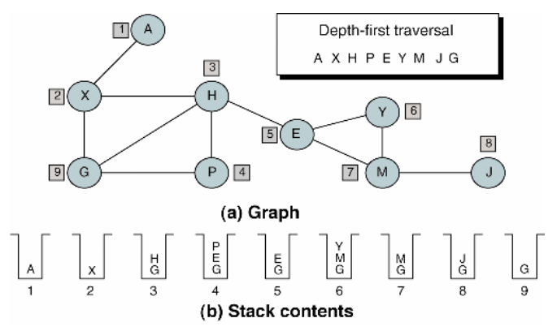

# 비선형(Non-Linear) 구조의 탐색

## 선형 구조

선형 구조를 간단히 설명하면, 말 그대로 진행하는 방향이 직선으로(일자로) 되어있는 구조이다. 알고리즘에서는 데이터가 연속적으로 연결되어있는 모양으로 구성이 된 것을 선형 구조라 한다. 선형 구조는 연결리스트, 스택, 큐, 덱 등이 있다.

> 선형 구조를 탐색하는 일반적인 방법론에는 순차검색과 이진검색이 있다.

 

## 비선형 구조

비선형 구조는 선형이 아닌 구조이다. 어떤 원소를 탐색했을 때 다음에 탐색할 수 있는 원소가 여러 개 존재하는 구조가 비선형 구조이다. 비선형 구조는 트리나 그래프 형태로 표현할 수 있다. 따라서, 트리나 그래프 형태의 정점을 탐색하는 것을 비선형 구조를 탐색하는 것이라고 할 수 있다.

> 트리는 순환(cycle)이 없는 그래프이다.

 

## 비선형 구조 탐색

비선형 구조는 탐색해야 할 데이터가 순차적이지 않다. 따라서 단순한 반복만으로 탐색할 수 없다. 이 때문에 스택이나 큐와 같은 자료구조를 활용하여 탐색할 방법과 순서를 만들어 탐색한다. 일반적으로 깊이우선탐색(depth first search; DFS)과 너비우선탐색(breadth first search; BFS)을 이용한다. 만약 탐색 대상이 그래프일 경우 탐색이 완료되면 [신장트리(spanning tree)](http://59.23.150.58/30stair/spanning_tree/spanning_tree.php?pname=spanning_tree#spanning)가 만들어진다.

> DFS와 BFS는 완전 탐색을 위한 방법이며, 가중치가 있는 그래프의 최단 거리를 찾기 위해서는 다익스트라와 플로이드-워셜 알고리즘이 주로 사용된다.

 

### 깊이우선탐색(DFS)

시작점에서 더는 이동할 수 없는 지점까지 탐색한 뒤, 인접한 정점이 있었던 곳으로 돌아가 같은 방법으로 차례로 탐색하는 방법이다. 이때 시작점(부모노드)으로 되돌아오는 과정을 백트래킹이라고 한다.

이러한 탐색 과정은 스택을 이용하는 것과 동일하기 때문에 스택을 사용하거나 재귀호출을 이용하여 구현한다.

현 경로상의 노드만 기억하면 되기 때문에 저장공간이 비교적 적게 필요하다. 또한, 목표 노드가 깊을 경우 유리하다.

반면, 해가 없는 너무 깊은 곳까지 탐색하게 되거나 목표에 이르는 경로가 많을 경우 비효율적이다. 또한, 찾은 경로가 최단 거리가 아닐 수 있다.

> 재귀호출을 하면 스택을 사용하는 것과 같은 효과를 낼 수 있다.

 

### 너비우선탐색(BFS)

시작 정점을 방문한 후 시작정점에 인접한 모든 정점을 방문한 뒤, 해당 정점들과 인접한 정점을 탐색하는 방법이다. 이는 큐와 동일하다.

하나의 레벨에서 보행 가능한 정점을 모두 찾아보기 때문에 목표 노드까지의 최단 길이가 결과로 나오는 것이 보장된다.

반면, 경로가 길 경우(깊을 경우) 많은 기억 공간이 필요하다. 또한, 무한그래프의 경우 탐색이 불가능하다.
> 무한 그래프는 정점이 무한한 그래프를 뜻한다. 
> - DFS의 경우 하나의 정점의 결과값을 찾아 들어가기 때문에 무한한 정점 중에서 하나의 해를 구할 수 있으면 된다.
> - 반면BFS의 경우, 정점이 무한하다면 다음 수준으로 나아가는 것 자체가 불가능해진다.

---

#### References

- [[알고리즘] 비선형구조의 탐색, 그래프의 구현 - https://12bme.tistory.com](https://12bme.tistory.com/123)
- [깊이*우선*탐색 - 위키백과](https://ko.wikipedia.org/wiki/%EA%B9%8A%EC%9D%B4_%EC%9A%B0%EC%84%A0_%ED%83%90%EC%83%89)
- [너비*우선*탐색 - 위키백과](https://ko.wikipedia.org/wiki/%EB%84%88%EB%B9%84_%EC%9A%B0%EC%84%A0_%ED%83%90%EC%83%89)
- [[그래프] DFS와 BFS 구현하기 :: 마이구미 - https://mygumi.tistory.com](https://mygumi.tistory.com/102)
- [[DFS][BFS] DFS 와 BFS - https://cru6548.tistory.com](https://cru6548.tistory.com/10)
