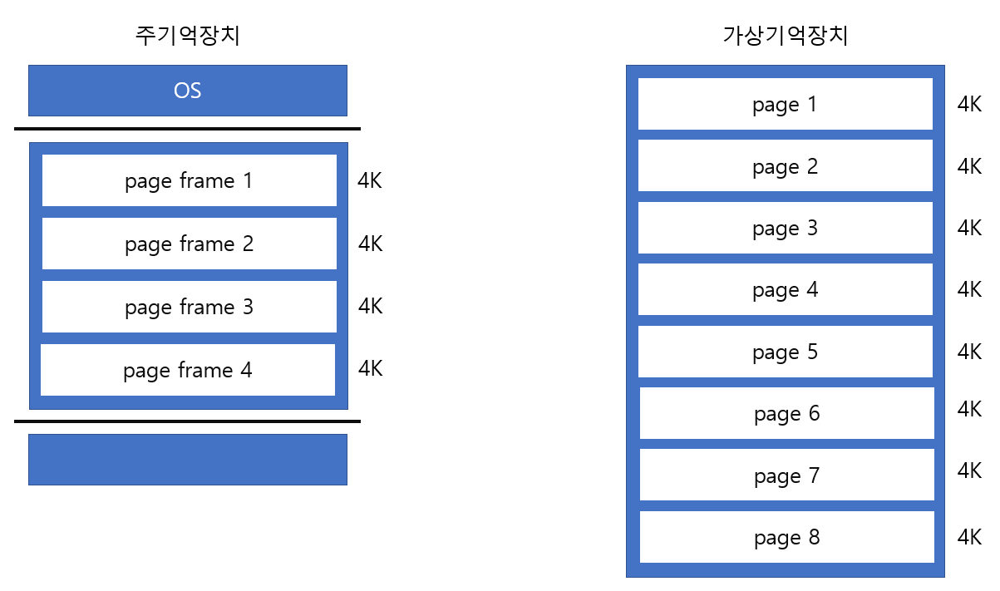
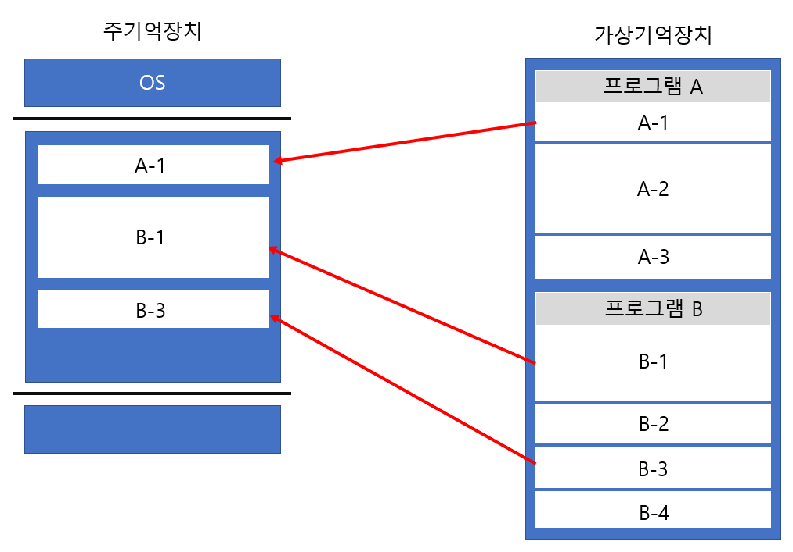

# 페이징 기법과 세그먼트 기법

## 가상기억장치

가상기억장치는 **주기억장치의 용량이 부족할 때 하드디스크의 일부 공간을 마치 주기억장치처럼 사용하는 기억장치**를 말한다.  
가상기억장치에 프로그램을 저장할 때는 불필요한 메모리 낭비를 줄이기 위해 프로그램을 여러 개의 블록 단위로 나눠 보관한다. 각각의 블록은 **mapping** 과정을 통해 주기억장치에 적재된다.   
주기억장치와 가상기억장치 간 프로세스를 무슨 단위로 load하고 store할지 정하는 방법에는 페이징 기법과 세그먼테이션 기법이 있다.

 

## 페이징 기법  

### Page와 Page frame, Swapping  

    

우선 페이징 기법은 위 그림과 같이 가상기억장치의 블록을 **고정 크기**로 나눈다. 이 블록을 **Page** 라고 부르며, 프로그램 실행시 요구되는 블록만 주기억장치에 적재된다. 주기억장치의 메모리 역시 Page와 같은 단위의 블록으로 나뉘는데, 이 명칭을 **Page frame** 이라고 한다.   
주기억장치에 모든 작업이 상주하지 않기 때문에 프로그램 실행 중 필요한 부분만 교체할 수 있다. 이를 **Swapping** 이라고 한다.   

 

### Page mapping - Page fault

Page mapping 과정을 위해서는 주기억장치에 **Page table** 이 생성된다.(때문에 Page의 크기가 작을수록 더 많은 주기억장치의 메모리가 낭비된다.) Page table은 Page의 번호, Page Frame의 시작주소 등이 저장되어있다.  
Page frame에 적재되는 Page가 교체되거나 Page fault가 발생할 때마다 Page Table은 갱신된다.    

**Page fault** 는 프로그램에서 필요로 하는 Page가 주기억장치에 있지 않는 경우에 발생하는 현상이다. Page fault가 발생하면 Page를 찾아 mapping하고 Page Table이 갱신되는 일이 발생된다. 이러한 현상을 줄이기 위해서 Page frame의 크기를 늘릴 수 있다.

  

### Thrashing

너무 많은 Page fault 현상으로 페이지 교체 시간이 프로세스 수행 시간보다 많은 경우를 말한다. Thrashing이 발생하면 CPU 이용률이 급격히 감소하므로 이를 방지하기 위해 다중 프로그래밍의 정도를 낮추거나 Page frame의 크기를 늘려야 한다.  

 

### 내부단편화

프로그램의 크기가 30k이고, 각 page의 고정 크기가 4k라고 한다면 마지막 page의 실질적 크기는 2k가 될 것이다. 따라서 마지막 page가 주기억장치에 적재될 때 2k만큼의 **내부단편화**가 발생된다. 즉 필요한 공간보다 더 큰 메모리가 할당되어 불필요하게 메모리가 낭비되는 현상을 내부단편화라고 한다. 이를 해결하기 위해 page를 작게 만들 수도 있지만 위에서 언급했듯이 page를 무조건 작게 만드는 것이 능사는 아니다.   

 

## 세그먼테이션 기법

세그먼테이션 기법은 페이징 기법과 달리 프로그램을 기능별로 분할하는 것을 말한다. 또한 주기억장치는 구분하지 않고, 전체를 비연속적으로 할당받는다. 따라서, 페이징 기법이 프로그램을 물리적으로 분할한 개념이라면 세그먼테이션은 논리적으로 분할한 개념이다.    

  

### Seg fault, 외부 단편화

세그먼테이션 기법에서는 세그먼트 길이에 맞는 주기억장치의 영역을 할당받지 못한 경우 해당 프로그램이 다른 프로그램의 영역을 침범하는 **Seg fault**가 발생할 수 있다.    

또한 고질적인 문제로 **외부단편화**가 발생할 수 있다. 위 그림에서 `B-1`의 크기가 6K,남은 공간이 3K라고 가정해보자. `B-1`의 프로세스가 끝나고 메모리를 해제하면 주기억장치에는 `A-1 / 빈공간(6k) / B-3 / 빈공간(3k)`가 있을 것이다. 여기에 7k 크기의 프로세스가 들어오려고 한다면, 총 공간은 9k지만 각 공간이 7k보다 작기 때문에 적재될 수 없다. 이런 현상을 외부 단편화라고 한다. 이를 해결하기 위해 `통합` 또는 `압축`을 할 수 있다.   
  
다음의 그림과 같이, 통합은 빈 공간의 주소가 인접한 경우 하나로 합치는 방법이고 압축은 프로세스의 재배치를 통해 모든 빈 공간을 하나로 합치는 방법이다. 

  

   

#### Reference
[특수기억장치 및 기억장치의 분류](http://junhojohn.blogspot.com/2018/11/blog-post_12.html)