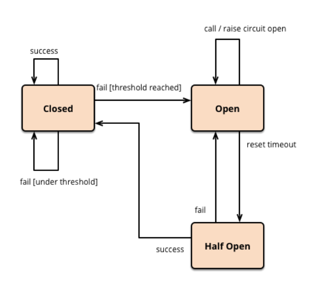

# MicroService Architecture

## Monolithic Architecture
> Monolithic : 단단히 짜여 하나로 되어 있는

Monolithic Architecture는 전통적인 웹 시스템 개발 스타일로, 모든 컴포넌트가 하나의 애플리케이션 내에 들어가 있는 구조이다. 예를 들어 온라인 쇼핑몰 애플리케이션을 구현할 때, 하나의 애플리케이션에 유저관리 서비스, 상품관리 서비스, 주문 관리 서비스 등을 만들고 하나의 서버(예를 들어 Tomcat)에서 이를 처리하도록 하는 것을 말한다.   
  
하나의 애플리케이션만 개발하면 되기 때문에 관리, 배포 및 테스트가 편리하고,
서비스간의 상호작용은 Method 호출을 이용하기 때문에 높은 성능을 보인다는 장점이 있다. 하지만 대형 시스템 개발 시에는 몇가지 문제점을 보인다. 

* 부분 장애가 전체 서비스 장애로 확대된다.

* 특정 기능에 한정해 선택적으로 확장할 수 없다. 

* 여러 컴포넌트가 하나의 서비스에 강결합 형태로 되어 있어 서비스의 변경이 매우 어렵고, 수정시 장애 영향도를 파악하기 힘들다.

* 빌드 시간, 테스트 시간이 길어진다.

* 지속적인 배포가 어려워진다.

<br/>

## MicroService Architecture

이러한 문제점을 해결하기 위해 등장한 것이 MSA이다. MSA는 각 서비스를 하나의 프로젝트로 구현하는 것을 의미한다. 즉, 각 서비스는 저마다의 서버와 DB를 갖는다. 구분된 각 단위를 **MS**라고 하며, MS가 합쳐져 **MSA**를 이루게 된다. MSA의 장점 및 특징은 다음과 같다. 

* 하나의 서비스가 다른 서비스에 영향을 주지 않는다.

* 선택적 확장이 가능하다.

* 빌드 및 테스트 시간이 단축된다.

* 지속적인 배포가 가능하다.

* 서비스간의 상호작용은 REST 방식의 호출을 통해 이루어지기 때문에 응답 처리 속도 및 성능 이슈가 있다. 

* 서비스가 여러 DB로 나뉘어 있기 때문에 데이터의 정합성을 유지하기 위한 트랜잭션 처리가 어려울 수 있다.  
계좌이체 과정을 예를 들어, 통장에서 돈을 출금하는 서비스를 호출한 후 다른 통장에 입금하는 서비스를 호출하다가 에러가 발생했다면 Monolithic Architecture에서는 Rollback을 통해 간단히 처리할 수 있지만, MSA에서는 불가능할 수 있다.     
이를 해결하기 위한 방법으로 `보상 트랜잭션`이 있다. 돈을 출금하는 서비스를 만들 때, 돈을 다시 입금하는 서비스를 만들어 놓고, 에러 발생 시 이 보상 트랜잭션을 호출하는 방법이다.   
또 다른 방법으로 분산 트랜잭션 시나리오 자체를 없애는 것이 있다. 분산 트랜잭션이 꼭 필요한 경우에는 Monolithic Architecture 방식으로 접근하는 것이 사실 맞는 방법이다. MSA는 트랜잭션 보장이 중요한 시스템보다는 대규모의 B2C형 서비스에 적합하다.  


<br/>

## Circuit Breaker  

위에서 언급했듯이, MSA의 장점 중 하나는 한 서비스에 장애가 생겨도 다른 서비스는 제공된다는 점이다. 그런데 만약, 장애가 생긴 서비스에 어떤 서비스가 접근한다면 어떻게 될까? 특정 서비스의 장애가 다른 서비스에도 전파되는, **장애 전파**가 발생한다. 이를 해결하기 위해서 등장한 것이 **Circuit Breaker** 다.  

Nefilx는 MSA를 제일 잘하는 기업 중에 하나이며 MSA 구축을 편하게 하는 기술과 갖가지 이슈에 대한 해결책을 제공하고 있다. 그 중 **Hystrix** 는 Neflix에서 제공하는 Circuit Breaker 구현체이다. 

### Hystrix 패턴

  

 `closed` 는 서비스의 초기 상태로, 서비스 호출 결과가 정상적인 경우 `closed` 상태를 유지한다.  
 만약 결과가 비정상적인 경우에는 `fallback` 으로 정의된 내용이 return되고 서비스가 `open` 상태로 바뀐다. 이 상태에서는 서비스로의 모든 접속이 차단되며 정해놓은 `timeout` 이 지나면 `half-open` 상태로 바뀐다.  
 `half-open` 상태는 `open` 상태의 서비스가 `closed` 상태로 변환될 수 있는지 지속적으로 체크하는 상태로 볼 수 있다. `half-open` 상태인 서비스를 호출을 해보고 성공을 하면 `closed` 상태로 바뀌고 끝이 난다.   하지만, 실패를 하면 `open` 상태로 다시 돌아가게 되고 이 서비스는  `timeout` 이 지난 후 다시 `half-open` 상태가 되는 이런 루틴이 반복된다.  

<br/>

## API GATEWAY

MSA는 한 서비스에 한 개 이상의 서버가 존재하기 때문에 이 서비스를 사용하는 클라이언트 입장에서는 다수의 end point가 생기게 되며, end point를 변경이 일어났을때, 관리하기가 힘들다. 그래서 MSA 환경에서 서비스에 대한 도메인을 하나로 통합할 수 있는 **API GATEWAY**가 필요하다. API GATEWAY는 API 서버 앞단에서 인증, 라우팅 기능 등 많은 기능을 담당할 수 있다. 

### Zuul 

Zuul은 Netflix에서 제공하는 API GATEWAY로, 다양한 형태의 Filter에 기능을 정의하여 이슈사항을 대비하고 있다. Filter를 크게 4가지로 나누면 다음과 같다.

* PRE Filter   
라우팅전에 실행되며 필터이다. 주로 logging, 인증등이 이곳에서 이루어진다.  

* ROUTING Filter   
요청에 대한 라우팅을 다루는 필터이다. Apache httpclient를 사용하여 정해진 Url로 보낼수 있고, [Neflix Ribbon](https://coe.gitbook.io/guide/load-balancing/ribbon)을 사용하여 동적으로 라우팅 할 수도 있다.  

* POST Filter   
라우팅 후에 실행되는 필터이다. response에 HTTP header를 추가하거나, response에 대한 응답속도, Status Code, 등 응답에 대한 statistics and metrics을 수집한다.  

* ERROR Filter   
에러 발생시 실행되는 필터이다.

<br/>  

### 인증  

클라이언트에 대한 인증을 API GATEWAY에서 직접적으로 하는 것은 아니다. API GATEWAY의 뒷단의 인증 서버에서 클라이언트를 인증하면 API GATEWAY는 APItoken을 발급해준다.   
APItoken은 API를 호출할 수 있는 권한 정보를 갖는다. 권한 정보는 토큰 자체에 저장되거나 서버에 저장될 수 있는데, 토큰 자체에 저장하는 형태를 클레임 기반의 토큰이라고 한다. 근래에 유행하는 JWT(JSON Web Token)이 여기에 해당된다. 
```
  {
    “name”:”JHRla”,
    “role”:[“admmin”,”enduser”]
  }
```
클레임 기반 토큰은 일정량 이상의 정보를 담기 어려우며 한번 발급된 토큰은 변경이 어렵다. 때문에 토큰의 유효기간을 설정하여 주기적으로 재발급하는 방식이 사용된다.

서버에 권한 정보를 저장하는 경우에는 클라이언트에 unique한 값만 부여한다. 때문에 보안상 유리하고, 많은 정보를 담을 수 있다. 하지만 모든 API 호출마다 서버에서 정보를 가져와야하기 때문에 DBMS보다는 [redis](https://github.com/Im-D/Dev-Docs/blob/master/Network/Cookie%EC%99%80%20Session%20%EA%B7%B8%EB%A6%AC%EA%B3%A0%20Redis.md#redis%EB%A5%BC-%EC%9D%B4%EC%9A%A9%ED%95%9C-session-%EA%B4%80%EB%A6%AC)와 같은 메모리 기반의 고속 storage를 사용하는 것이 좋다. 

<br/>

#### Reference
[Monolithic Architecture 란?](https://alwayspr.tistory.com/19)  
[Microservice Architecture 란?](https://alwayspr.tistory.com/20)  
[대용량 웹서비스를 위한 마이크로 서비스 아키텍쳐의 이해](https://bcho.tistory.com/m/948)  
[배민 API GATEWAY - spring cloud zuul 적용기](http://woowabros.github.io/r&d/2017/06/13/apigateway.html)  
[MSA 아키텍쳐 구현을 위한 API 게이트웨이의 이해](https://bcho.tistory.com/1005)    
[행복을 찾기 위한 우리의 여정](https://medium.com/coupang-tech/%ED%96%89%EB%B3%B5%EC%9D%84-%EC%B0%BE%EA%B8%B0-%EC%9C%84%ED%95%9C-%EC%9A%B0%EB%A6%AC%EC%9D%98-%EC%97%AC%EC%A0%95-94678fe9eb61)  
[Hystrix](https://coe.gitbook.io/guide/circuit-breaker/hystrix)  
