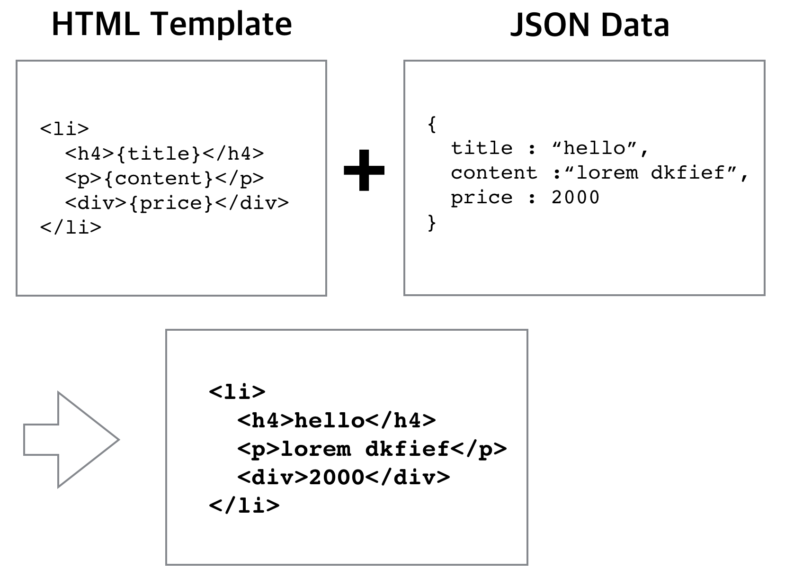
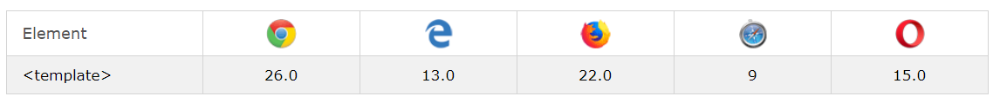

# HTML Templating

서버에서 데이터를 받아온 뒤, DOM 트리에 추가하거나 삭제하거나 교체할 경우가 생길 수 있다. 이러한 작업이 반복적이고(특히 AJAX를 사용할 때) 매번 필요한 태그가 비슷하다면, 즉 구조가 비슷한데 데이터만 다를경우 **templating**이 효율적인 방법일 수 있다.

<br/>

**Templating**은 HTML과 데이터를 합쳐서 웹 화면에 출력을 해주는 것이다. 이 작업은 클라이언트에서 할 수도 있고 서버에서 할 수도 있다.
> 클라이언트에서 html을 그리는 것을 CSR(Client-Side Rendering ), 서버에서 그리는 것을 SSR(Server-Side Rendering)이라고 한다.<br/>참고 - [서버 사이드 렌더링(SSR)](https://github.com/Im-D/Dev-Docs/blob/master/Performance/%EC%84%9C%EB%B2%84%20%EC%82%AC%EC%9D%B4%EB%93%9C%20%EB%A0%8C%EB%8D%94%EB%A7%81(SSR).md#%ED%81%B4%EB%9D%BC%EC%9D%B4%EC%96%B8%ED%8A%B8-%EC%82%AC%EC%9D%B4%EB%93%9C-%EB%A0%8C%EB%8D%94%EB%A7%81-vs-%EC%84%9C%EB%B2%84-%EC%82%AC%EC%9D%B4%EB%93%9C-%EB%A0%8C%EB%8D%94%EB%A7%81)

슬라이드를 만든다고 생각해보자, 버튼을 누르면 그림이 바뀌어야 한다.


이 때 그림을 미리 불러와서 저장해두는 것이 아니라, 미리 만들어진 HTML 양식 안에 서버에서 불러오는 데이터를 넣어주는 식이다.

<br/>

## 템플릿과 데이터 결합



위의 예시를 코드로 표현하면 아래와 같을 것이다.

```js
var html = "<li><h4>{title}</h4><p>{content}</p><div>{price}</div></li>";
var resultHTML = html
  .replace("{title}", data.title)
  .replace("{content}", data.content)
  .replace("{price}", data.price);
```

저장해둔 템플릿을 이런 식으로 처리할 수 있는데, 데이터가 여러 개라면 루프를 이용하여 처리할 수도 있다.

> 참고 - [JavaScript Templating Without a Library](https://jonsuh.com/blog/javascript-templating-without-a-library/)

또한, 처리해야 하는 양이 너무 많다면 서버에서 처리한 뒤 가져오는 것도 방법이 될 수 있다.

<br/>

## 템플릿 보관

위와 같이 자바스크립트에 HTML을 직접 보관하는 것은 좋지 않은 방법이다.

이외에 템플릿을 보관할 수 있는 두 가지 방법이 있다.

1. 서버에서 file에 보관하고, Ajax로 요청해서 불러온다.
2. HTML 코드 안에 숨겨둔다.

<br/>

템플릿이 많고 복잡할 경우 1번의 방법을 사용하는 것이 좋을 것이다. 하지만, 간단한 템플릿의 경우 HTML 코드 안에서 숨겨서 사용할 수도 있다.

<br/>

`<script>` 태그의 `type`이 **javascript 가 아니면, 렌더링 하지 않고 무시한다.** 이를 이용해 템플릿을 숨겨둘 수 있다.

```html
<script id="item" type="text/template">
  <li>
    <h4>{title}</h4>
    <p>{content}</p>
    <div>{price}</div>
  </li>
</script>
```

가져올 때는 이렇게 하면 된다.

```js
var html = document.querySelector("#item").innerHTML;
```

또한, 특정 부위에 넣고 싶으면 `insertAdjacentHTML` 을 사용할 수도 있다.

<br/>

## Template 태그

HTML5 에서는 `<template>` 태그가 추가됐다.

```html
<template>
  <li>
    <h4 id="title" />
    <p id="content" />
    <div id="price" />
  </li>
</template>
```

<br/>

`<script>` 로 넣는 것과 차이점은 텍스트가 아닌, **element** 로 보관이 된다. 따라서 `innerHTML` 을 사용하지 않아도 자식 요소를 넣을 수 있기 때문에 보다 안전하다. 하지만, 브라우저 지원이 한정적이다.



> 템플릿 태그는 HTML태그로 인식되지만, 활성화 되지 않으면 렌더링되지 않는다. 이 때, 활성화는 `importNode()` 혹은 `cloneNode()` 등을 사용한 경우와 같이 **deep copy** 를 하여 템플릿의 `.content` 를 복사하는 경우를 말한다. 이 때, `.content` 속성은 템플릿의 내부를 포함하는 읽기 전용의 DocumentFragment 이다.
> ```js
> <template>
>   <h2>Template</h2>  
> </template>
>
> <script>
> // 1. importNode 사용
>  var t = document.querySelector("#myTemplate");
>  var clone = document.importNode(t.content, true);
>  document.body.appendChild(clone);
>
> // 2. cloneNode 사용> 
>   var temp2 = document.getElementsByTagName("template")[0];
>   var clone2 = temp.content.cloneNode(true);
>   document.body.appendChild(clone2);
> </script>
> ```

<br/>

## Template 리터럴
뿐만 아니라, ES6의 템플릿 리터럴을 사용하여 템플레이팅 작업을 할 수 있다.

참고 - [Tagged Template Literals](https://github.com/Im-D/Dev-Docs/blob/master/ECMAScript/Tagged_Template_Literals.md)

---

#### References

- [부스트코스 - HTML templating](https://www.edwith.org/boostcourse-web/lecture/16761/)
- [부스트코스 - HTML templating 실습](https://www.edwith.org/boostcourse-web/lecture/16761/)
- [HTML <template> Tag](https://www.w3schools.com/tags/tag_template.asp)
- [HTML's New Template Tag](https://www.html5rocks.com/ko/tutorials/webcomponents/template/)
