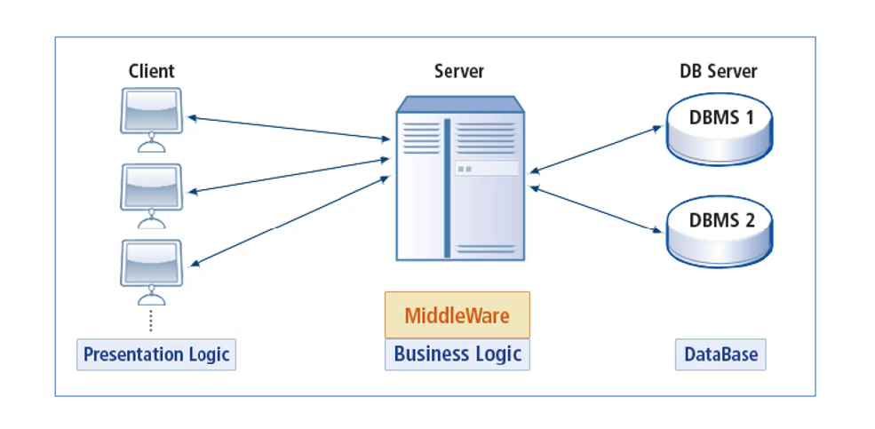

# WAS(Web Application Server)

## 웹 서버(Web Server)

클라이언트가 요청한 문서나 자원을 전달하는 역할을 한다.

클라이언트는 서버에게 서비스를 요청한다.

서버는 서비스 제공한다.

 

## 2-Tier Architecture

### DBMS(Data Base Management System)

DBMS등장 이전에는 데이터를 저장하고 불러오는것을 직접 구현 해야했다. 하지만, 데이터가 많아지며 별도의 관리가 필요해졌고 DBMS가 등장하였다. 

 

DMBS는 보통 서버 형태로 서비스를 제공한다. 따라서 DBMS에 직접 접속해서 동작하는 클라이언트 프로그램이 만들어졌다.

이러한 방식은 클라이언트의 로직이 많아지고, 클라이언트 프로그램의 크기가 커지며, 로직이 변경되면 클라이언트가 새로 배포되어야 한다.

또한, 로직이 클라이언트에 포함되어 배포되기 때문에 보안이 나쁘다.

 

### CGI(Common Gateway Interface)

초기 웹은 정적 데이터만 보여줬다. 웹 서버 본연의 기능은 미리 준비된 정보(정적 리소스)를 클라이언트의 요청에 따라 응답해주는 것이기 때문이다.

웹이 발전하며 동적인 기능을 요구하기 시작했다. 지금은 너무 당연하지만, 웹에서 데이터를 입력하고 조회하는 것 또한 동적인 기능이다.

당연히, 이러한 기능들은 별도의 프로그래밍을 통해 구현해야 한다. 이를 위해 웹 서버에서 프로그래밍 기능이 들어가는 방식을 CGI라고 한다.

> 서버 프로그램 내부의 프로그램에서 처리한 결과를 클라이언트에 응답하도록 서버와 내부 프로그램을 이어주는 방법 혹은 규칙이 CGI이다.

 

단순한 프로그래밍에서는 문제가 없었다. 하지만, 프로그램이 복잡해지고 DBMS와 연계되는 작업이 많아지면서 사용자가 증가할수록 성능이 떨어지는 문제가 발생했다.

 

## 3-Tier Architecture

### 미들웨어(MiddleWare)

2-Tier Architecture의 단점으로 미들웨어가 등장하게 되었다. 클라이언트와 데이터베이스 서버 사이에 다른 서버를 두는 방식이다.

클라이언트는 요청만 보내고, 미들웨어에서 로직을 수행한다. 만약, 데이터 조작이 필요하면 미들웨어가 DBMS에 작업을 맡기고 그 결과를 클라이언트에게 전달한다.

클라이언트는 응답을 받아서 출력만 하면되고, 미들웨어에 요청만 보내면 되기 때문에 프로그램의 크기가 줄어든다. 또한, 로직이 바뀌어도 다시 배포할 필요 없이 미들웨어만 수정하면 된다.

 

## WAS(Web Application Server)

넓은 의미에서 미들웨어라고 할 수 있다.

웹 클라이언트의 요청 중 웹 애플리케이션이 동작하도록 지원하는 목적을 가진다.

 

### 기능

- 프로그램 실행환경과 데이터 베이스 접속 기능을 제공한다.
- 여러 개의 트랜젝션을 관리한다.
- 업무 처리 비즈니스 로직을 수행한다.

 

이외에도 웹 서버의 기능도 기본적으로 제공한다(톰캣만 설치해도 별도의 웹 서버가 필요 없는 이유이다).  하지만, 초창기의 WAS는 내장 웹서버의 성능이 좋지 않았다. 따라서 아파치 서버와 톰캣 서버를 함께 실행을 해서 사용하는 경우가 많았다. 하지만, 현재는 WAS에 내장되어 있는 웹 서버의 성능이 많이 개선되어 톰캣만으로도 충분히 동작하는 경우가 많아졌다.

하지만, 그럼에도 큰 규모의 프로젝트에서는 웹 서버에서 정적인 컨텐츠를 웹 브라우저로 전송하고, WAS는 동적인 결과를 전송하는 역할을 하도록 나눈다.

### WAS와 웹 서버를 나누는 이유

- 자원 이용의 효율성
    - 웹 서버는 보다 간단하게 만들어졌다. 따라서, 정적인 동작은 웹 서버에서 하는 것이 더 효율적이다.
- 장애 극복(failvoer)
    - WAS에서 동작하도록 만든 프로그램이 오작동하여 WAS자체에 문제가 발생할 수 있다. 따라서 WAS를 재시작 해야 하는 경우가 생길 수 있다. 만약 WAS 서버가 여러개 있다면, 문제가 발생한 WAS에 웹 서버에서 클라이언트가 접근 하지 못하게 한 뒤  WAS의 문제를 처리한다면, 무중단으로 서비스를 운영할 수 있다.
        > 참고 - [로드밸런싱과 클러스터링](https://github.com/Im-D/Dev-Docs/blob/master/Network/%EB%A1%9C%EB%93%9C%EB%B0%B8%EB%9F%B0%EC%8B%B1%20&%20%ED%81%B4%EB%9F%AC%EC%8A%A4%ED%84%B0%EB%A7%81.md)
- 배포 및 유지 보수의 편의성

 

---

#### References

- [WAS - 부스트코스](https://www.edwith.org/boostcourse-web/lecture/16666/)
- [CGI - 정보통신기술용어해설](http://www.ktword.co.kr/word/abbr_view.php?m_temp1=651&m_search=cgi)
- [common gateway interface (CGI)](https://whatis.techtarget.com/definition/common-gateway-interface-CGI)
- [What is Difference Between Two-Tier and Three-Tier Architecture?](http://www.softwaretestingclass.com/what-is-difference-between-two-tier-and-three-tier-architecture/)
