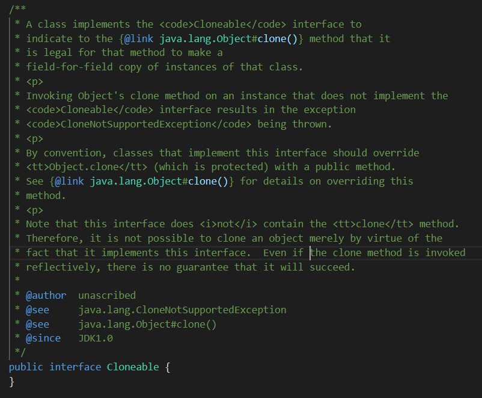

# 객체 복사

객체 지향 프로그래밍에서 객체를 복사하는 방법에 크게 두 가지가 있다.

- 얕은 복사(shallow copy) : 참조(메모리 주소)를 복사
- 깊은 복사(deep copy) : 참조하는 메모리 안의 값을 복사

> 참고 - [객체 복사 - 복사 방식](https://ko.wikipedia.org/wiki/%EA%B0%9D%EC%B2%B4_%EB%B3%B5%EC%82%AC#%EB%B3%B5%EC%82%AC_%EB%B0%A9%EC%8B%9D)

## 얕은 복사

얕은 복사를 할 경우 객체 인스턴스의 주소가 복사된다.

```java
Object original = new Object();
Object shallowCopy = original;

original.equals(new Object()); // false
original.equals(shallowCopy); // true
```
> 참조를 저장한 변수 명은 달라지지만, 같은 인스턴스를 공유한다. 정확히는 같은 인스턴스를 공유하는 다른 이름의 변수가 생성된 것이다.

얕은 복사는 같은 인스턴스를 공유한다. 따라서 복사한 변수를 이용하여 인스턴스의 필드를 바꾸게 되면 원본 객체의 필드도 변화한다.

```java
class UserInfo{
    private String name;
    
    // standard constructors, getters and setters
}
```

```java
void shallowCopyTest(){
    UserInfo someUser = new UserInfo("someName");
    UserInfo shallowCopy = someUser;
    
    shallowCopy.setName("changedName");
    
    someUser.getName(); // It returns "changedId"
    shallowCopy.getName(); // It return "changedId"
}
```

깊은 복사를 할 경우 이를 해결할 수 있다.

## 깊은 복사

깊은 복사를 할 경우 복사한 변수를 이용하여 인스턴스의 필드를 변경해도 원본 객체가 변하지 않는다.

```java
void deepCopyTest(){
    UserInfo someUser = new UserInfo("someName");
    UserInfo deepCopy = ...; /*something for deep copy...*/
    
    deepCopy.setName("changedName");
    
    someUser.getName(); // It returns "someId"
    deepCopy.getName(); // It returns "changedId"
}
```

Java에서 깊은 복사를 하는 방법에는 크게 세 가지가 있다.

- 새로운 객체를 생성하여 값을 직접 넣어준다.
- 복사 생성자나 팩토리 메서드를 사용한다.
- Cloneable Interface를 구현한다.

### 값을 직접 넣어주기

가장 간단한 방법이다.

```java
void deepCopyTest(){
    UserInfo someUser = new UserInfo("someId", "someName");
    UserInfo deepCopy = new UserInfo(someUser.getId(), someUser.getName());
    
    deepCopy.setId("changedId");
    deepCopy.setId("changedName");
    
    someUser.getId(); // It returns "someId"
    deepCopy.getId(); // It returns "changedId"
}
```

예제는 `UserInfo` 클래스의 필드가 두 개 밖에 없으므로 간단히 작성할 수 있지만, 만약 필드가 많아진다면 객체를 복사할 때 마다 많은 작업을 해야 할 것이다.

```java
UserInfo deepCopy = new UserInfo(someUser.getId(), someUser.getName(), someUser.getAddress(), someUser.getCellPhoneNumber, someUser.getSex(), someUser.getAlias(), someUser.get...);
```

생성자를 사용하지 않는다면 매번 필드 수 만큼의 불필요한 라인이 추가될 것이다.

```java
UserInfo deepCopy1 = new UserInfo();
deepCopy.setId(someUser.getId());
deepCopy.setName(someUser.getName())
deepCopy.setAddress(someUser.getAddress())
deepCopy.setCellPhoneNumber(someUser.getCellPhoneNumber)
deepCopy.setSex(someUser.getSex());
deepCopy.setAlias(someUser.getAlias());
deepCopy.set...;

UserInfo deepCopy2 = new UserInfo();
deepCopy.setId(someUser.getId());
deepCopy.setName(someUser.getName())
deepCopy.setAddress(someUser.getAddress())
deepCopy.setCellPhoneNumber(someUser.getCellPhoneNumber)
deepCopy.setSex(someUser.getSex());
deepCopy.setAlias(someUser.getAlias());
deepCopy.set...;
```

다른 방법들을 사용하면 이 문제를 해결할 수 있다.

### 복사 생성자(Copy Constructor)

복사 생성자는 말 그대로 객체를 복사하는 생성자를 만들어 주는 것이다.

```java
// UserInfo의 복사 생성자
public UserInfo(UserInfo userInfo){
    this.name = userInfo.getName();
    this.Address = new Address(userInfo.getAddress());
    /* 다음과 같이 구현할 수도 있다.
     * this(userInfo.getName(), userInfo.getAddress());
     */
}

// Address의 복사 생성자
public Address(Address address){
    this.name = address;
}
```

### 복사 팩토리(Static Factory Method, 정적 팩토리 메서드)

복사 팩토리는 복사 생성자의 변형이다.

> 팩토리 패턴과 다르다.

```java
public static UserInfo newInstanceCopiedByUserInfo(UserInfo userInfo){
    return new UserInfo(userInfo);
    /* 복사 생성자를 만들지 않았다면 다음과 같이 구현할 수도 있다.
     * this(userInfo.getName(), userInfo.getAddress());
     */
}
```

> 복사 팩토리는 이름을 가질 수 있기 때문에 복사 생성자를 쓴 것 보다 기능을 더욱 명확하게 나타낼 수 있는 장점이 있다. 복사 생성자는 기능이 명확하고 단순하기 때문에 복사 팩토리의 장점이 많이 드러나지 않지만, 일반적으로 생성자 대신 복사 팩토리를 사용하면 생기는 이점들이 있다. 이는 다음 글들을 참고하면 좋을 것 같다.
>
> - [Java Constructors vs Static Factory Methods](https://www.baeldung.com/java-constructors-vs-static-factory-methods)
> - [정적 팩토리 메서드(static factory method)](https://johngrib.github.io/wiki/static-factory-method-pattern/)

### Cloneable Interface

복사를 구현할 객체에 `Cloneable`을 구현하고, `Object.clone()`을 재정의 하여 사용한다. `Cloneable`을 구현하지 않고 `Object.clone()`만 재정의하여 사용할 경우 `CloneNotSupportedException`이 발생한다.

```java
class UserInfo implements Cloneable{
    private String id;
    private String name;
    
    // standard constructors, getters and setters
    
    @Override
    protected UserInfo clone() throws CloneNotSupportedException {
      return (UserInfo) super.clone();
  }
}
```

```java
void cloneableTest(){
    UserInfo someUser = new UserInfo("some id", "some name");
    UserInfo deepCopy = someUser.clone();
    
    deepCopy.setId("changed id");
    deepCopy.setId("changed name");
    
    someUser.getId(); // It returns "someId"
    deepCopy.getId(); // It returns "changedId"
}
```

>  참고 - [Interface Cloneable](https://docs.oracle.com/javase/8/docs/api/java/lang/Cloneable.html)

```java
class UserInfo implements Cloneable{
    private String name;
    private Address address;
    
    // standard constructors, getters and setters
    
    @Override
    protected UserInfo clone() throws CloneNotSupportedException {
      return (UserInfo) super.clone();
  }
}

class Address {
  private String name;

  // standard constructors, getters and setters
}
```

만약 위와 같이 클래스 필드가 값이 아닌 주소를 참조하는 객체일 경우 해당 객체는 깊은 복사가 되지 않는다.

```java
void cloneableTest(){
    UserInfo someUser = new UserInfo("some name", new Address("address name"));
    UserInfo deepCopy = someUser.clone();
    
    deepCopy.getAddress().setName("changed address Name");
    
    someUser.getAddress().getName(); // It returns "changed address Name"
    someUser.getAddress().getName(); // It returns "changed address Name"
}
```

이럴 경우 `Address`에 `clone()` 메소드를 구현한 뒤 , `UserInfo`의 `clone()` 메소드를 아래처럼 정의해야 한다.

```java
@Override
protected UserInfo clone() throws CloneNotSupportedException {
    UserInfo result = (UserInfo) super.clone();
    result.setAddress(result.getAddress().clone());

    return result;
}
```

> 참조로 인한 변경 가능성을 낮추기 위해 객체 필드를 final로 선언할 경우 위와 같은 방법은 사용할 수 없다.

### Cloneable은 지양하는 것이 바람직하다

#### 언어모순적이다

Java에서 새로운 객체를 생성하기 위해서 `new` 키워드와 생성자를 사용하기로 약속되어있다. 하지만 `clone()`을 사용하면 이러한 동작 없이 새로운 객체를 생성한다. 새로운 객체를 생성하는 규칙을 클라이언트에게 맡기는 것은 위험한 일이다.

#### clone의 규약은 허술하다

`clone()`의 일반 규약은 매우 허술하다. api문서에서 조차 클래스마다 'copy'의 의미가 달라질 수 있다고 말한다. 따라서 예시에서 사용했던 것과 같이 특정 클래스의 경우 `clone()`이 잘 동작하게 하기 위해 새롭게 재정의하여야 한다.

> 참고 - [Object.clone](https://docs.oracle.com/javase/8/docs/api/java/lang/Object.html#clone--)

#### 고려해야 할 사항이 많다

1. `Cloneable` 은 해당 클래스가 `Object.clone()`을 사용할 것이라고 명시적으로 선언해주는 역할을 하는 인터페이스다. `Cloneable` 인터페이스 내에 아무 것도 작성되어있지 않기 때문에 `Object`의 `clone()` 을 직접 재정의해야 한다. 이 때, `clone()`은 `Object` 타입을 리턴하기 때문에 리턴타입을 수정하고 `return` 문에서는 형변환을 해주어야 쓰기 편리하다.

2. 정상적인 설계라면 `Clonable` 안에 `clone()`을 정의하여 `Cloneable`을 구현할때 `clone()`을 구현하지 않을 경우 컴파일 오류를 발생 시키는 식으로 되어야 한다. 
   
    > `java.lang.Cloneable`은 위와 같이 작성되어있다.
    
   하지만, 위에서 설명했듯 `Clonable` 인터페이스 내에 아무것도 작성되어있지 않다.
   이러한 설계 오류로 인해 `clone()` `CloneNotSupportedException`을 추가했다. 따라서 `clone()` 을 편하게 쓰려면 이에 대한 처리를 해줘야 한다.

   ```java
   @Override
   protected UserInfo clone() throws CloneNotSupportedException {
       try {
         UserInfo result = (UserInfo) super.clone();
         result.setAddress(result.getAddress().clone());
   
         return result;
       } catch (CloneNotSupportedException e) {
         throw new AssertionError(); // 발생할 수 없는 일이다.
       }
   }
   ```

3. 또한 방어적 코딩을 위해 validation을 해주는 것이 필요할 수 있다.

   ```java
   if(someUser instanceof Cloneable){
       deepCopy = someUser.clone();
   }
   ```

복사 생성자 혹은 복사 팩토리와 `Cloneable`을 잘 비교한 글들이 있는데, 더 자세히 알고 싶다면 아래의 글을 읽어보길 권한다.

- [Copy Constructor versus Cloning - Josh Bloch on Design](https://www.artima.com/intv/bloch.html#part13)
- [Java Cloning - How Copy Constructors are Better Than Cloning](https://www.programmingmitra.com/2017/01/Java-cloning-copy-constructor-versus-Object-clone-or-cloning.html)

#### References

- [Effective Java 3/E](https://github.com/WegraLee/effective-java-3e-source-code)
