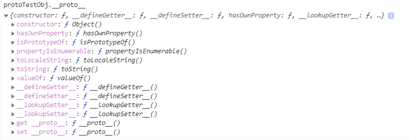
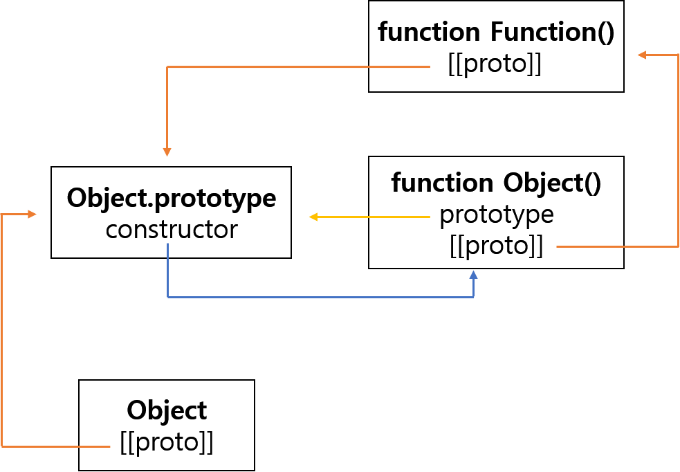

# 프로토타입(Prototype)

자바스크립트로 객체지향 프로그래밍을 할 수 있다. 하지만 대부분의 객체지향 언어와 달리 클래스가 아닌, 프로토타입으로 객체지향 프로그래밍을 구현한다. 또한, 클래스라는 개념이 없기 때문에 별도의 객체 생성 방법이 존재한다.

> 참고 - [객체](https://github.com/Im-D/Dev-Docs/blob/master/Javascript/object.md)

> ES6부터는 자바스크립트에도 `class` 가 생겼는데, 이는 프로토타입 기반 패턴의 Syntatic sugar 이다.<br/>
> 참고 - [class](https://github.com/Im-D/Dev-Docs/blob/master/Javascript/B_Class.md)

<br/>

## 프로토타입 객체

프로토타입 객체(이하 프로토타입)는 자바스크립트에서 생성된 객체들의 부모역할을 한다. 모든 객체는 프로토타입의 프로퍼티 또는 메소드를 상속받아 사용한다.

생성된 객체의 프로토타입은 다음과 같은 메소드들을 가진다.



```js
const protoTestObj = {};

// protoTestObj에 정의하지 않은 메소드를 사용할 수 있다.
protoTestObj.hasOwnProperty("name"); // true
```

다음과 같이 프로토타입에 프로퍼티를 정의하여 사용할 수 있다. 프로토타입에 프로퍼티를 정의한 뒤 참조하는 것과 같다. 따라서 각각의 객체마다 프로퍼티를 정의해야하는 문제점을 해결해준다.

```js
protoTestObj.__proto__.testProperty = "prototype test!";

protoTestObj.testProperty; // prototype test!
```

프로토타입은 객체를 생성할 때 결정된다. 결정된 프로토타입 객체는 다른 객체로 변경할 수 있다. 즉, 프로토타입을 동적으로 변경할 수 있는 것이다. 프로토타입은 생성된 객체의 부모이다. 따라서 이를 이용하여 상속을 구현할 수 있다.

```js
const protoTestObj2 = {
  test() {
    console.log("test");
  }
};
protoTestObj.__proto__ = protoTestObj2;

protoTestObj.test; // test
```

<br/>

## 프로토타입 프로퍼티

### [[Prototype]]

모든 객체는 `[[Prototype]]` 프로퍼티를 가지며 이는 자신의 프로토타입 객체를 가리킨다.

> 크롬 브라우저에서 `[[Prototype]]` 은 `__proto__` 로 표현된다.

<br/>

### prototype

함수도 객체이기 때문에 `[[Prototype]]` 을 가지는데, 함수는 추가적으로 `prototype` 프로퍼티를 가진다. 또한, 함수의 `[[Prototype]]` 은 `Function.prototype` 을 가리킨다.

```js
const testFunc = () => {};

testFunc.__proto__ === Function.prototype; // true
```

<br/>

`prototype` 프로퍼티는 함수 객체가 생성자로 사용될 때 인스턴스화 된 객체의 부모 역할을 할 프로토타입을 가리킨다. 다시 말하면 같은 생성자 함수로 만든 객체는 같은 프로토타입을 가리킨다.

```js
function TestConstructor() {}

const testInstance1 = new TestConstructor();
const testInstance2 = new TestConstructor();

testInstance1.__proto__ === TestConstructor.prototype; // true
testInstance2.__proto__ === TestConstructor.prototype; // true
testInstance2.__proto__ === TestConstructor.__proto__; // false
```

또한, `prototype` 프로퍼티도 객체이기 때문에 `[[Prototype]]` 프로퍼티를 갖는다.

<br/>

### constructor

프로토타입 객체는 `constructor` 프로퍼티를 갖는다. `constructor` 프로퍼티 `constructor` 프로퍼티는 자신을 생성한 객체를 가리킨다.

```js
// testInstance는 TestConstructor의 프로토타입을 상속받기 때문에 constructor 프로퍼티를 갖는다.
testInstance1.constructor === TestConstructor; //true
```

<br/>

`constructor` 프로퍼티는 원본 객체를 가리킨다. 또한 해당 `constructor` 프로퍼티의 `prototype` 객체는 다시 `constructor` 프로퍼티를 갖는다. 프로토타입 객체의 `constructor` 프로퍼티는 원본 객체를 가리키므로 `prototype` 과 `constructor` 는 서로 참조한다고 할 수 있다.

```js
TestConstructor.prototype.constructor === TestConstructor; // true
TestConstructor.prototype.constructor.prototype === TestConstructor.prototype; // true
```

<br/>

## 프로토타입 체인

객체의 프로퍼티나 메소드에 접근할 때, 해당 객체에 해당되는 프로퍼티가 없다면 `[[Prototype]]` 이 가리키는 프로토타입의 프로퍼티를 검색한다.

<br/>

### 객체의 프로토타입

생성자 함수를 통해 생성된 객체는 원본 객체를 가리킨다. 즉 `Object()` 생성자 함수로 만들어진 객체는 `Object` 객체를 기리킨다.

> 객체 리터럴 또한 `Object` 객체를 가리킨다. <br/>
참고 - [객체](https://github.com/Im-D/Dev-Docs/blob/master/Javascript/object.md#%EC%9E%90%EB%B0%94%EC%8A%A4%ED%81%AC%EB%A6%BD%ED%8A%B8%EC%97%90%EC%84%9C-%EC%A0%9C%EA%B3%B5%ED%95%98%EB%8A%94-%EC%83%9D%EC%84%B1%EC%9E%90-%EC%82%AC%EC%9A%A9)

또한, 자바스크립트에서 제공하는 내장 객체들의 `[[Prototype]]` 은 `Object` 객체의 프로토타입을 가리킨다.

따라서 모든 객체는 최종적으로 `Object` 객체의 프로토타입을 가리킨다.



<br/>

### 함수의 프로토타입

함수는 내부적으로 `Function()` 생성자 함수를 이용하여 생성된다. 따라서 함수는 `Function` 객체의 프로토타입에 정의된 프로퍼티들을 사용할 수 있다. 또한, `Function` 객체의 `[[Prototype]]` 은 `Object` 를 가리킨다.

<br/>

## 원시 타입(Primitive type)의 프로토타입

자바스크립트의 원시 타입은 객체가 아니다. 하지만 프로토타입을 가지고 있다.

```js
const num = 1;
const numObj = new Number("1");

num.__proto === numObj.proto__;
```
> 위와 같은 이유로, `string` 타입의 변수는 원시타입임에도 `String` 객체의 메소드를 호출하여 사용할 수 있다.
> ```js
> const str = "str"
> str.length // 3
> ```

<br/>

## 프로토타입 객체의 수정과 변경

프로토타입 객체를 수정하는 것은 프로토타입 참조에 영향을 주지 않는다. 하지만, 프로토타입 객체를 다른 객체로 변경하는 것은 프로토타입 참조에 영향을 준다.

```js
function TestConstructor() {}
const testInstance1 = new TestConstructor();

TestConstructor.prototype.testProperty = "test property!";
const testInstance2 = new TestConstructor();

TestConstructor.prototype = {};
testInstance3 = new TestConstructor();

testInstance1.testProperty; // test property
testInstance2.testProperty; // test property
testInstance3.testProperty; // undefined
```

위의 경우 `property` 객체가 변했기 때문에 `property` 객체 안에는 `constructor` 객체가 존재하지 않을 것이다. 대신 빈 객체가 존재한다. 따라서 `protoperty` 와 `constructor` 의 연결이 깨진다.

---

#### References

- [Prototype - poiemaweb](https://poiemaweb.com/js-prototype)
