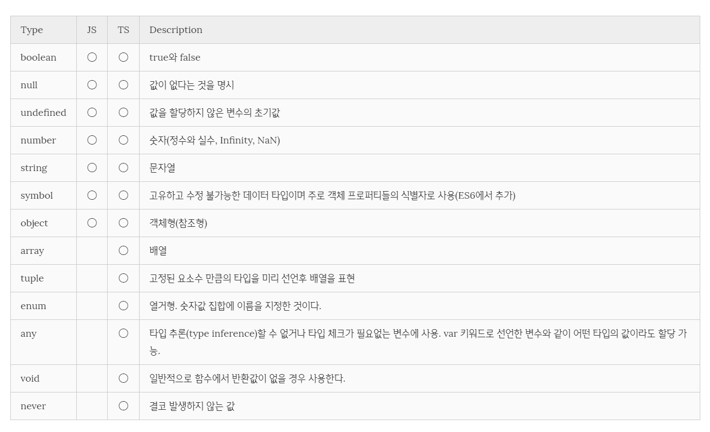

# 정적 타이핑

## Typescript의 등장

기존에 사용하던 `Javascript`는 대표적인 동적 타이핑의 언어다. 즉, 타입이 정적이지 않기 때문에 `Java`나 `C`와 같은 C-Family 언어와 같은 정적 타입의 언어보다 좀 더 자유롭게 사용할 수 있다. 물론, 이 부분에 대해서 긍정적인 사람도 있고 부정적인 사람도 있다.

개인적인 생각으로 `Javascript`을 이용하여 큰 규모의 애플리케이션을 개발하면 동적 타입이라는 특성이 불편하게 다가올 때가 많았다. 예를 들어, `string`으로 넘어오는 숫자를 `number`타입으로 명시적 변환을 시켜준다던가 하는 것이 그 예다.

물론, `Typescript`에는 기존의 `ES5`와 `ES6`에서 제공하던 기능보다 좀 더 많은 기능을 제공하고 있지만, 가장 기본적이고 큰 차이점은 `C-Family` 언어와 같이 정적 타입의 언어라는 것이다.

`ES5`와 `ES6`에서 사용하던 기능들을 그대로 사용하면서 정적 타이핑을 제공하며 그에 수반되는 추가적인 기능들을 제공한다. 덕분에 타입에 대한 에러를 줄이면서 개발할 수 있는 장점이 있다.

<br/>

## 타입의 종류

기존에 `Javascript`에서 사용하던 타입을 그대로 사용하면서 `Typescript`자체적으로 추가적인 타입들을 제공한다.

<br/>



<br/>

```ts
// boolean
const isTs: boolean = true;

// null
const n: null = null;

// undefined
const u: undefined = undefined;

// number
const num: number = 6;

// string
const name = 'BKJang';
const greeting: string = `Hello ${name}`;

// object
const obj: object = {};

// array
const anyList: any[] = [1, 'two', true];
const numList: number[] = [1, 2, 3];

// tuple : 고정된 요소수 만큼의 타입을 미리 선언후 배열을 표현
const tuple: [string, number];
tuple = ['hello', 10]; // OK
tuple = [10, 'hello']; // Error
tuple = ['hello', 10, 'world', 100]; // OK
tuple = ['hello', 10, 'world']; // OK
tuple.push(true); // Error

// enum : 열거형은 숫자값 집합에 이름을 지정한 것이다.
enum Color1 {Red, Green, Blue};
const c1: Color1 = Color1.Green;

console.log(c1); // 1

enum Color2 {Red = 1, Green, Blue};
const c2: Color2 = Color2.Green;

console.log(c2); // 2

enum Color3 {Red = 1, Green = 2, Blue = 4};
const c3: Color3 = Color3.Blue;

console.log(c3); // 4

/*
any: var로 선언한 데이터와 동일하다.
*/
const anyData: any = 5;
anyData = `this is string type`;
anyData = true;

// void
function printHello(): void {
  console.log("Hello World");
}

/*
never : never는 함수 표현식의 리턴 타입이거나, 항상 예외를 던지는 화살표 함수 표현식이거나, 리턴하지 않는 표현식이다. 
*/

// Function returning never must have unreachable end point
function error(message: string): never {
  throw new Error(message);
}

// Inferred return type is never
function fail() {
    return error("Something failed");
}

// Function returning never must have unreachable end point
function infiniteLoop(): never {
    while (true) {
    }
}
```

위와 같이 `Typescript`의 타입은 모두 소문자다. `Typescript`에서 만약 `string`이 아닌 `String`으로 타입을 선언하면 String 래퍼 객체가 타입으로 지정된다. 즉, 객체도 타입이 될 수 있다.(`Java`에서 `Generics`를 생각하면 쉽다. `Typescript`에도 `Generic`이 있기 때문이다.)

```ts
let stringValue: string;
stringValue = 'Hello'; //It's ok
stringValue = new String('Hello'); //Error

let stringObj: String;

stringObj = 'Hello'; //It's ok
stringObj = new String('Hello'); //It's ok
```

```ts
// Date 타입
const now: Date = new Date();

// HTMLElement 타입
const elem: HTMLElement = document.getElementById('id');

class Person { }
// Person 타입
const person: Person = new Person();
```

<br/>

## 함수 매개변수의 타입

`Typescript`에서는 함수의 매개변수도 타입을 지정하여 받을 수 있다. 지정한 타입의 매개변수가 아니라면 에러를 출력하기 때문에 복잡한 애플리케이션에서도 타입 에러를 줄여서 개발할 수 있다.

```ts
function person(name: string, age: number): string {
    return `name : ${name}, age : ${age}`;
}

console.log(person('BKJang', 27)); //name : BKJang, age : 27
console.log(person('BKJang', '27')); //Type error
```

<br/>

## 타입 추론

`Typescript`에서 타입의 선언을 만약 생략한다면 최초에 할당된 값의 타입에 따라 타입이 정해진다. 이에 따라 이미 결정된 타입의 변수에 다른 값을 할당하면 에러가 발생한다. 이를 **타입 추론**이라고 한다.

```ts
let value = 6; //타입 추론에 의하여 value 변수는 number 타입의 변수로 선언된다.

value = 'Hello'; //Type error
```

만약 `Javascript`와 같은 동적 타입의 언어라면 위와 같이 `Hello`라는 새로운 값을 할당했을 때 에러가 발생하지 않을 것이다. 하지만 `Typescript`에서는 타입 추론에 의해 이미 `value`가 `number`타입으로 정해졌기 때문에 `number`가 아닌 다른 타입의 값을 할당하면 타입 에러가 발생한다.

```ts
let value;

value = 'Hello'; //It's ok
value = 6; //It's ok
```

하지만 위와 같이 `value`라는 변수를 최초에 선언할 때 값을 할당하지 않으면 `any`타입으로 정해지기 때문에 `var`와 같이 동적으로 값을 할당할 수 있는 상태가 된다. <br/>
하지만 `any` 타입의 선언 방식은 `Typescript`를 사용하는 의미가 없어지기 때문에 사용하지 않는 것이 좋다.

<br/>

---

#### Reference

- [Poiemaweb - 정적타이핑](https://poiemaweb.com/typescript-typing)
- [Typescript hand book - Basic Types](http://www.typescriptlang.org/docs/handbook/basic-types.html)
- [Typescript hand book - Type Inference](https://www.typescriptlang.org/docs/handbook/type-inference.html)