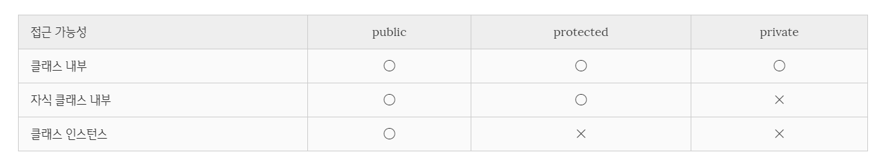

# 클래스(class)

## ES6 class vs Typescript class

`ES6`가 도입되며 등장한 `class`의 개념과 비슷하지만 `Typescript`에서 `class`는 `ES6`의 `class`에서 제공하는 기능을 포함하는 동시에 좀 더 확장된 기능을 제공하고 있다.

```js
class Developer {
    constructor(name, lang) {
        this.name = name;
        this.lang = lang;
    }

    printPersonalInfo() {
        console.log(`${this.name}'s main programming language is ${this.lang}`);
    }
}
```

```ts
class Developer {
    name : string;
    lang : string;

    constructor(name: string, lang: string) {
        this.name = name;
        this.lang = lang;
    }

    printPersonalInfo() {
        console.log(`${this.name}'s main programming language is ${this.lang}`);
    }
}

const bkjang = new Developer('BKJang', 'Typescript');
bkjang.printPersonalInfo(); // BKJang's main programming language is Typescript
```

위의 소스에서 볼 수 있듯이 `Typescript`에서는 `class`를 정의할 때 `ES6`와 다르게 클래스 몸체에 클래스 프로퍼티를 사전 선언하여야 한다.

<br/>

## 접근 제어자

`Typescript`에서 제공하는 접근 제어자는 `public`, `protected`, `private`이 있다.

`Typescript`의 default 접근 제어자는 `public`이다. 따라서 자식 클래스와 클래스의 인스턴스에서도 프로퍼티와 메서드에 접근하길 원하면 일반적으로 접근제어자를 생략한다.

각각의 접근 제어자는 아래와 같은 접근 가능성을 가진다.

<br/>



<br/>

```ts
class Parent {
    public x : string;
    protected y : string;
    private z : string;

    constructor(x: string, y: string, z: string) {
        this.x = x;
        this.y = y;
        this.z = z;
    }
}

const parent = new Parent('x', 'y', 'z');

// 1. 클래스의 인스턴스
console.log(parent.x); // x

console.log(parent.y); // error

console.log(parent.z); // error
```

```ts
class Child extends Parent {
    constructor(x: string, y: string, z: string) {
        super(x, y, z);
    }

    // 2. 자식 클래스에서의 public
    console.log(x); // x

    // 3. 자식 클래스에서의 protected
    console.log(y); // y

    // 4. 자식 클래스에서의 private
    console.log(z); // error
}
```

### 생성자 매개변수에 접근 제어자 적용

생성자의 매개변수에서도 마찬가지로 접근 제어자를 적용할 수 있다. 접근 제어자가 적용된 매개변수는 생성자 내부에서 별도의 초기화 과정이 없어도 자동으로 초기화 과정이 수행된다.

생성자의 매개변수에는 `public`과 `private` 접근 제어자가 사용되며 특성은 위에서 설명한 것과 동일하다.

```ts
class Person {
    constructor(public name: string, private age: number) { }
}

const bkjang = new Person('BKJang', '27');

console.log(bkjang); // Person { name: 'BKJang', age: 27 }

console.log(bkjang.name); // 'BKJang'

// private으로 선언된 생성자의 매개변수는 클래스 외부에서 접근할 수 없다.
console.log(bkjang.age); // error
```

생성자의 매개변수에 접근 제어자를 선언하지 않으면 생성자 매개변수는 생성자 내부에서만 유효한 지역변수가 되기 떄문에 생성자 외부에서 참조가 불가능하다. (클래스 내부에서도 생성자의 외부라면 접근이 불가하다.)

```ts
class Foo {
    constructor(x: string) { }
}

const foo = new Foo('BKJang');
console.log(foo); // Foo {}
```

<br/>

## readonly

`Typescript`에서는 `readonly`키워드를 제공하고 있다. 키워드의 이름만 보면 읽기 전용이라는 느낌이 든다. 즉, 기존 `Javascript`의 `const`와 다를게 없어 보이지만 `readonly`는 생성자 내에서만 값을 할당할 수 있다. 일반적으로 상수 선언에 많이 사용된다.

```ts
class Person {
    private readonly MAX_AGE: number;

    constructor() {
        this.MAX_AGE = 30;
    }

    setMaxAge() {
        this.MAX_AGE = 20; // Cannot assign to 'MAX_AGE' because it is a constant or a read-only property.
        console.log(this.MAX_AGE); // 30
    }
}

const person = new Person();

person.setMaxAge();
```

<br/>

## static

`Typescript`에서 제공하는 `static` 키워드는 `ES6`와 마찬가지로 인스턴스 명이 아닌 `class`명으로 접근한다. 즉, 인스턴스를 생성하지 않아도 접근할 수 있다.

```js
class ES6 {
    constructor() { }

    static helloWorld() {
        console.log('Hello ES6');
    }
}

const es6 = new ES6();

ES6.helloWorld(); // Hello ES6
es6.helloWorld(); // Uncaught TypeError: es6.helloWorld is not a function
```

단, `Typescript`에서는 `static`키워드를 클래스 몸체의 프로퍼티에서도 사용할 수 있다. <br/>사실, 어떻게 생각하면 클래스의 프로퍼티를 `Typescript`에서는 클래스 몸체에 사전 선언하는 점을 생각하면 당연히 가능한 것일 수도 있다.

```ts
class Person {
    static lang = 'Javascript';

    constructor() {
        lang = 'Typescript';
    }
}

const person = new Person();

console.log(Person.lang); // Typescript
console.log(person.lang); // error : Property 'lang' does not exist on type 'Person'
```

위에서 볼 수 있듯이 `Typescript`에서도 `static`키워드가 붙은 프로퍼티나 메서드는 클래스 명으로만 접근할 수 있다.

---

#### Reference

- [Poiemaweb - 클래스](https://poiemaweb.com/typescript-class)
- [bkdevlog - [ES6]6. 클래스(class)](https://bkdevlog.netlify.com/posts/class)
- [Typescript hand book - Classes](https://www.typescriptlang.org/docs/handbook/classes.html)